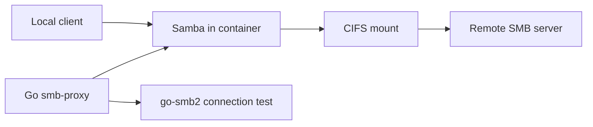

# smb-proxy

Go-based SMB proxy as a Docker image. Connects to a remote SMB server (credentials via environment variables) and exposes the share locally over SMB.

Source: [github.com/danielgtmn/smb-proxy](https://github.com/danielgtmn/smb-proxy)

## Quick start

Pull the image and run in gateway mode:

```bash
docker run -d \
  --name smb-proxy \
  --privileged \
  -p 1445:445 \
  -e SMB_HOST=192.168.1.100 \
  -e SMB_SHARE=daten \
  -e SMB_USER=backup \
  -e SMB_PASSWORD=geheim \
  -e LOCAL_SHARE=proxy \
  -e LOCAL_USER=proxy \
  -e LOCAL_PASSWORD=lokal \
  ghcr.io/danielgtmn/smb-proxy:latest
```

## Modes

| Mode | Description |
| --- | --- |
| `gateway` (default) | Authenticates with remote credentials, mounts the share, and exports it locally via Samba. Clients connect with `\\localhost\<LOCAL_SHARE>`. |
| `tcp` | Pure TCP forwarder from local port to remote SMB server. Authentication happens on the client side against the target server. |

## Environment variables

### General

| Variable | Required | Default | Description |
| --- | --- | --- | --- |
| `SMB_PROXY_MODE` | no | `gateway` | `gateway` or `tcp` |
| `SMB_HOST` | yes | — | Hostname or IP of the remote SMB server |
| `SMB_PORT` | no | `445` | Remote port |
| `LOCAL_PORT` | no | `445` | Local SMB port inside the container |

### Gateway mode

| Variable | Required | Default | Description |
| --- | --- | --- | --- |
| `SMB_SHARE` | yes | — | Remote share name |
| `SMB_USER` | yes | — | Username for the remote server |
| `SMB_PASSWORD` | yes | — | Password for the remote server |
| `SMB_DOMAIN` | no | — | Windows domain |
| `LOCAL_SHARE` | no | `proxy` | Name of the locally exported share |
| `LOCAL_USER` | no | `proxy` | Local Samba user |
| `LOCAL_PASSWORD` | yes* | — | Password for local clients |
| `LOCAL_ALLOW_GUEST` | no | `false` | Allow guest access without a password |
| `MOUNT_PATH` | no | `/mnt/remote` | Mount path inside the container |

\* Not required when `LOCAL_ALLOW_GUEST=true`.

## Docker

### Build

```bash
docker build -t smb-proxy .
```

### Gateway (recommended)

```bash
docker run -d \
  --name smb-proxy \
  --privileged \
  -p 1445:445 \
  -e SMB_PROXY_MODE=gateway \
  -e SMB_HOST=192.168.1.100 \
  -e SMB_SHARE=daten \
  -e SMB_USER=backup \
  -e SMB_PASSWORD=geheim \
  -e LOCAL_SHARE=proxy \
  -e LOCAL_USER=proxy \
  -e LOCAL_PASSWORD=lokal \
  ghcr.io/danielgtmn/smb-proxy:latest
```

Connect:

- Windows/macOS: `\\localhost\proxy` (port 1445 may need to be mapped via `net use` / port forwarding)
- Linux: `smbclient //localhost/proxy -p 1445 -U proxy`

### TCP proxy

```bash
docker run -d \
  --name smb-proxy \
  -p 1445:445 \
  -e SMB_PROXY_MODE=tcp \
  -e SMB_HOST=192.168.1.100 \
  ghcr.io/danielgtmn/smb-proxy:latest
```

In TCP mode, clients authenticate directly against the remote server. Remote credentials from environment variables are not used.

## Release

Images are published to GHCR when a GitHub Release is published:

- `ghcr.io/danielgtmn/smb-proxy:<tag>`
- `ghcr.io/danielgtmn/smb-proxy:latest` (stable releases only)

### docker compose

```bash
cp docker-compose.yml docker-compose.local.yml
# Adjust values in docker-compose.local.yml
docker compose -f docker-compose.local.yml up -d
```

## Local development

```bash
go run ./cmd/smb-proxy
```

Gateway mode requires Linux with `mount.cifs` and `smbd` (typically root).

## Architecture



1. Go verifies the remote connection with `go-smb2`.
2. The remote share is mounted via `mount.cifs`.
3. Samba exports the mount as a local share.

## Notes

- The container requires `--privileged` or `CAP_SYS_ADMIN` for CIFS mounts.
- Port `445` is often in use on macOS; use e.g. `-p 1445:445`.
- For production: provide secrets via Docker Secrets or a vault, not in plain text in compose files.
