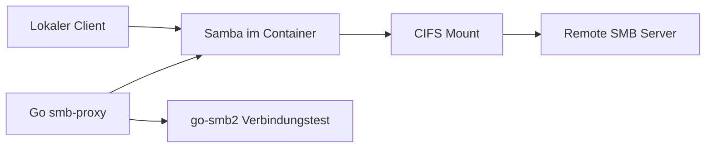

# smb-proxy

Go-basierter SMB-Proxy als Docker-Image. Verbindet sich mit einem entfernten SMB-Server (Credentials per Environment-Variable) und stellt den Share lokal als SMB bereit.

Source: [github.com/danielgtmn/smb-proxy](https://github.com/danielgtmn/smb-proxy)

## Quick start

Pull the image and run in gateway mode:

```bash
docker run -d \
  --name smb-proxy \
  --privileged \
  -p 1445:445 \
  -e SMB_HOST=192.168.1.100 \
  -e SMB_SHARE=daten \
  -e SMB_USER=backup \
  -e SMB_PASSWORD=geheim \
  -e LOCAL_SHARE=proxy \
  -e LOCAL_USER=proxy \
  -e LOCAL_PASSWORD=lokal \
  ghcr.io/danielgtmn/smb-proxy:latest
```

## Modi

| Modus | Beschreibung |
| --- | --- |
| `gateway` (Standard) | Authentifiziert sich mit den Remote-Credentials, mountet den Share und exportiert ihn lokal über Samba. Clients verbinden sich mit `\\localhost\<LOCAL_SHARE>`. |
| `tcp` | Reiner TCP-Forwarder von lokalem Port zum Remote-SMB-Server. Die Authentifizierung erfolgt clientseitig gegen den Zielserver. |

## Environment-Variablen

### Allgemein

| Variable | Pflicht | Standard | Beschreibung |
| --- | --- | --- | --- |
| `SMB_PROXY_MODE` | nein | `gateway` | `gateway` oder `tcp` |
| `SMB_HOST` | ja | — | Hostname oder IP des Remote-SMB-Servers |
| `SMB_PORT` | nein | `445` | Remote-Port |
| `LOCAL_PORT` | nein | `445` | Lokaler SMB-Port im Container |

### Gateway-Modus

| Variable | Pflicht | Standard | Beschreibung |
| --- | --- | --- | --- |
| `SMB_SHARE` | ja | — | Remote-Share-Name |
| `SMB_USER` | ja | — | Benutzer für den Remote-Server |
| `SMB_PASSWORD` | ja | — | Passwort für den Remote-Server |
| `SMB_DOMAIN` | nein | — | Windows-Domain |
| `LOCAL_SHARE` | nein | `proxy` | Name des lokal exportierten Shares |
| `LOCAL_USER` | nein | `proxy` | Lokaler Samba-Benutzer |
| `LOCAL_PASSWORD` | ja* | — | Passwort für lokale Clients |
| `LOCAL_ALLOW_GUEST` | nein | `false` | Gastzugriff ohne Passwort erlauben |
| `MOUNT_PATH` | nein | `/mnt/remote` | Mount-Pfad im Container |

\* Nicht erforderlich, wenn `LOCAL_ALLOW_GUEST=true`.

## Docker

### Build

```bash
docker build -t smb-proxy .
```

### Gateway (empfohlen)

```bash
docker run -d \
  --name smb-proxy \
  --privileged \
  -p 1445:445 \
  -e SMB_PROXY_MODE=gateway \
  -e SMB_HOST=192.168.1.100 \
  -e SMB_SHARE=daten \
  -e SMB_USER=backup \
  -e SMB_PASSWORD=geheim \
  -e LOCAL_SHARE=proxy \
  -e LOCAL_USER=proxy \
  -e LOCAL_PASSWORD=lokal \
  ghcr.io/danielgtmn/smb-proxy:latest
```

Verbinden:

- Windows/macOS: `\\localhost\proxy` (Port 1445 muss ggf. über `net use` / Port-Forwarding gemappt werden)
- Linux: `smbclient //localhost/proxy -p 1445 -U proxy`

### TCP-Proxy

```bash
docker run -d \
  --name smb-proxy \
  -p 1445:445 \
  -e SMB_PROXY_MODE=tcp \
  -e SMB_HOST=192.168.1.100 \
  ghcr.io/danielgtmn/smb-proxy:latest
```

Im TCP-Modus authentifizieren sich Clients direkt gegen den Remote-Server. Die Remote-Credentials aus den Environment-Variablen werden nicht verwendet.

## Release

Images are published to GHCR when a GitHub Release is published:

- `ghcr.io/danielgtmn/smb-proxy:<tag>`
- `ghcr.io/danielgtmn/smb-proxy:latest` (stable releases only)

### docker compose

```bash
cp docker-compose.yml docker-compose.local.yml
# Werte in docker-compose.local.yml anpassen
docker compose -f docker-compose.local.yml up -d
```

## Lokale Entwicklung

```bash
go run ./cmd/smb-proxy
```

Gateway-Modus benötigt Linux mit `mount.cifs` und `smbd` (typischerweise root).

## Architektur



1. Go prüft die Remote-Verbindung mit `go-smb2`.
2. Der Remote-Share wird per `mount.cifs` eingebunden.
3. Samba exportiert den Mount als lokalen Share.

## Hinweise

- Der Container benötigt `--privileged` oder `CAP_SYS_ADMIN` für CIFS-Mounts.
- Port `445` ist auf macOS oft belegt; nutze z. B. `-p 1445:445`.
- Für Produktion: Secrets über Docker Secrets oder einen Vault bereitstellen, nicht im Klartext in Compose-Dateien.
